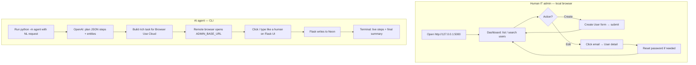
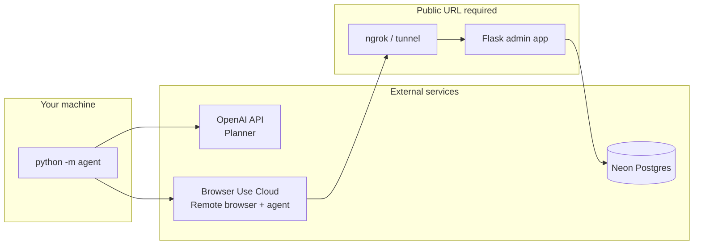
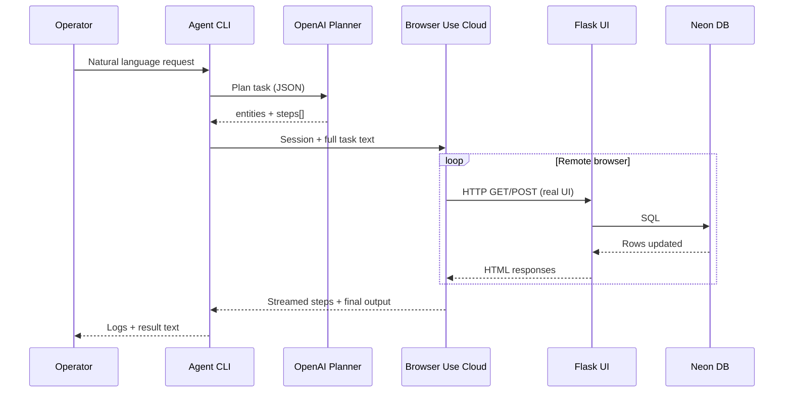
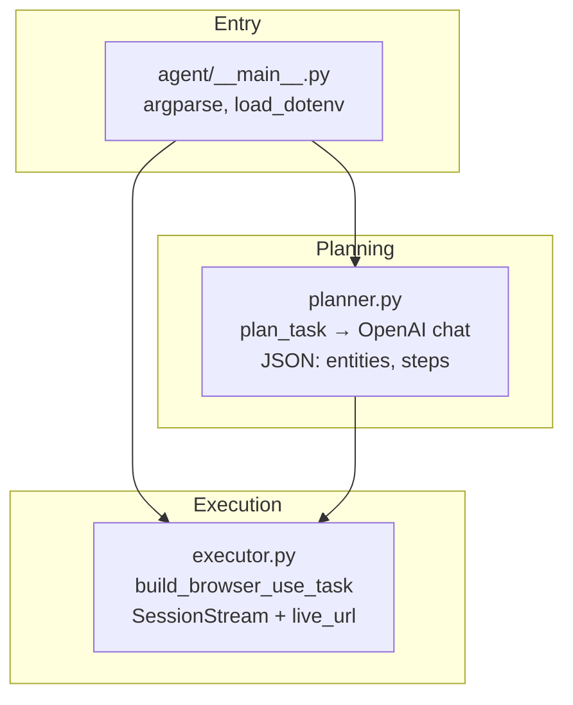
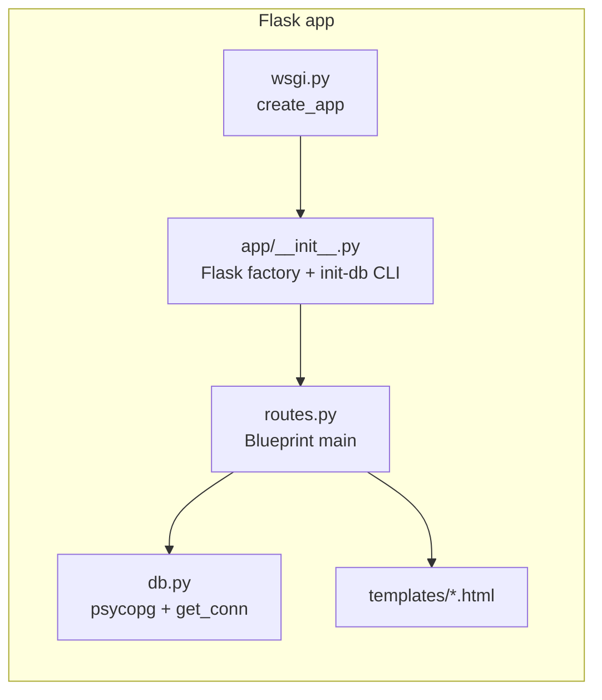
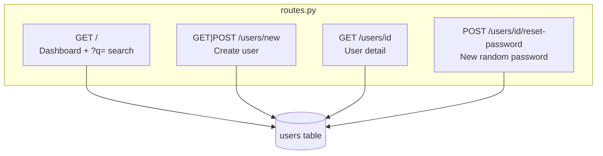
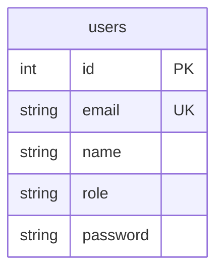

# AI IT Support Agent

An **AI worker** completes IT-style tasks by using a **web admin console** like a human: it reads a natural-language request, plans steps with **OpenAI**, then **Browser Use Cloud** drives a real browser against your **Flask** app. Data is stored in **Neon Postgres**. The agent does **not** call your Flask routes from Python to “cheat”—it only interacts through the UI.

---

## Table of contents

1. [User flow](#user-flow)
2. [High-level design (HLD)](#high-level-design-hld)
3. [Low-level design (LLD)](#low-level-design-lld)
4. [Repository layout](#repository-layout)
5. [Why `ADMIN_BASE_URL` must be public](#why-admin_base_url-must-be-public)
6. [Setup and run](#setup-and-run)
7. [Testing](#testing)
8. [Official documentation links](#official-documentation-links)

---

## User flow

Two ways to use the system: **manual** (human in the browser) or **automated** (CLI agent).



**Typical automated request examples**

- Create user: `python -m agent "Create user jane@company.com with name Jane Doe and role user"`
- Reset password: `python -m agent "Reset password for jane@company.com"`
- Optional flags: `--open-live` (open live browser view), `--recording` (session video when Cloud provides URLs)

### Example: IT Support threads (Teams-style)

Illustrative chat snippets similar to **Microsoft Teams** IT channels. The automated responder is labeled **Agent** (an app/bot posting ticket updates).

---

**User** — *Just now*  
My 2FA authenticator got wiped when I reset my phone. Locked out of everything.  
*1 reply*

**Agent · APP** — *Just now*  
Identity verified. 2FA reset and new backup codes sent to your recovery email. Re-enroll your authenticator app when ready — you're back in.  
*Ticket resolved*

---

**User** — *Just now*  
My laptop keeps freezing during Zoom calls. It's happened 3 times today.  
*1 reply*

**Agent · APP** — *Just now*  
Done! A Figma Professional seat has been provisioned to sofia@company.com. Check your inbox for the activation link.  
*Ticket resolved*

---

**User** — *Just now*  
We’re running out of space on the marketing shared drive — can we expand it?  
*1 reply*

**Agent · APP** — *Just now*  
Storage expanded from 500GB to 1TB for the marketing shared drive. Current usage is now at 48%. Let me know if you need a usage report.  
*Ticket resolved*

---

## High-level design (HLD)

**System context:** the operator runs a command on their machine; external services (OpenAI, Browser Use, Neon) and a tunneled Flask app cooperate to complete the task.



**Logical pipeline** (what happens in one agent run):



---

## Low-level design (LLD)

### Agent process (Python package `agent/`)



| Module | Responsibility |
|--------|----------------|
| `agent/__main__.py` | Parses CLI (`request`, `--recording`, `--skills`, `--open-live`), calls planner then executor. |
| `agent/planner.py` | `SYSTEM_PROMPT` + OpenAI JSON output: `entities` (email, name, role, …) and `steps` (`goto`, `click`, `fill`, `select`). |
| `agent/executor.py` | Merges plan into one **Browser Use task** string; optional **reset-password autonomy** block; `sessions.create` + `SessionStream` for live logs; polls `live_url`. |

### Flask application (`app/`)



### HTTP routes and pages



### Database (Neon)



**Initialization:** `flask --app wsgi init-db` runs `CREATE TABLE IF NOT EXISTS users (...)`.

### Data flow: who writes to the database?

Only **Flask** runs SQL when forms are submitted from the browser. The **agent CLI never** uses `psycopg` to mutate users for task completion—the Cloud browser submits the same forms a human would.

---

## Repository layout

```
tru/
├── wsgi.py                 # Flask entry: app = create_app()
├── requirements.txt
├── .env.example
├── app/
│   ├── __init__.py         # create_app(), flask init-db
│   ├── db.py               # Neon connection
│   ├── routes.py           # Blueprint + routes
│   └── templates/          # Jinja2 UI
└── agent/
    ├── __main__.py         # CLI
    ├── planner.py          # OpenAI → JSON plan
    └── executor.py         # Browser Use Cloud
```

---

## Why `ADMIN_BASE_URL` must be public

Browser Use runs the browser on **their** infrastructure. It cannot reach `http://127.0.0.1:5000` on your laptop. Use **ngrok** (or similar), set `ADMIN_BASE_URL` to the **HTTPS** forwarding URL, and keep Flask on port 5000 locally.

**Security:** This demo has **no authentication** on the admin UI. Do not expose real data.

---

## Setup and run

### Prerequisites

- Python 3.11+
- [Neon](https://neon.tech/) database
- [OpenAI](https://platform.openai.com/) API key
- [Browser Use](https://cloud.browser-use.com/) API key (`bu_…`)

### Commands (PowerShell)

```powershell
cd E:\tru
python -m venv .venv
.\.venv\Scripts\Activate.ps1
pip install -r requirements.txt
copy .env.example .env
# Edit .env: DATABASE_URL, OPENAI_*, BROWSER_USE_API_KEY, SECRET_KEY, later ADMIN_BASE_URL
flask --app wsgi init-db
flask --app wsgi run --host 127.0.0.1 --port 5000
```

**Tunnel (for the agent):**

```powershell
ngrok http 5000
```

Set `ADMIN_BASE_URL=https://YOUR-NGROK-HOST` in `.env`.

**Run the agent:**

```powershell
cd E:\tru
.\.venv\Scripts\Activate.ps1
python -m agent "Create user demo@company.com with name Demo User and role user"
python -m agent "Reset password for demo@company.com"
python -m agent "Reset password for demo@company.com" --open-live
```

**Watch live:** CLI prints a **LIVE BROWSER** URL and streamed `›` step lines; see [Browser Use FAQ — live URL](https://docs.browser-use.com/cloud/faq).

---

## Testing

### A. Admin panel only (no Cloud)

1. `flask --app wsgi init-db` and run Flask.
2. Open `http://127.0.0.1:5000`.
3. Test dashboard, search, create user, user detail, reset password.

### B. Full stack

1. Valid `.env`, Flask + ngrok, `ADMIN_BASE_URL` public.
2. Run agent create + reset commands; verify rows in Neon or UI.

### C. Recording

```powershell
python -m agent "Reset password for demo@company.com" --recording
```

---

## Official documentation links

- [Flask](https://flask.palletsprojects.com/)
- [Neon — Connect from any app](https://neon.tech/docs/connect/connect-from-any-app)
- [psycopg 3](https://www.psycopg.org/psycopg3/docs/)
- [Browser Use Cloud — Quick start](https://docs.browser-use.com/cloud/quickstart)
- [Browser Use — Agent (v3)](https://docs.browser-use.com/cloud/agent/quickstart)
- [OpenAI API](https://platform.openai.com/docs/overview)
